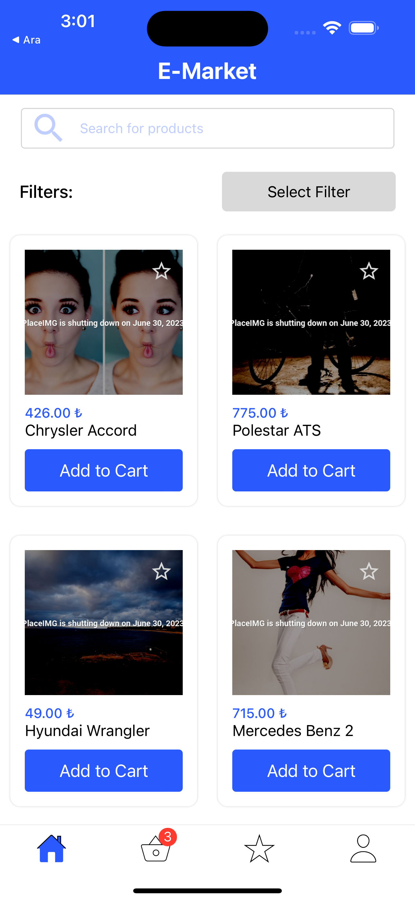
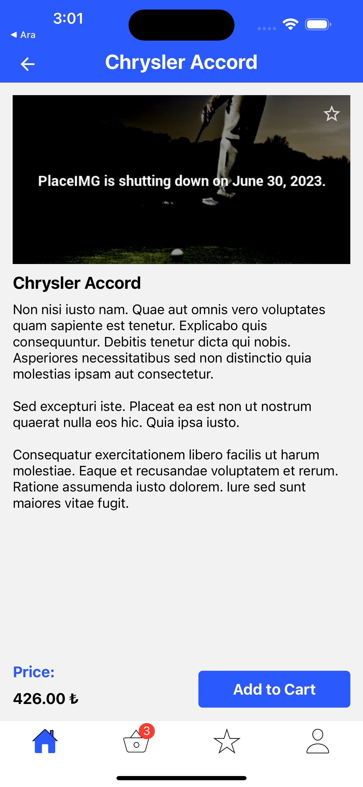
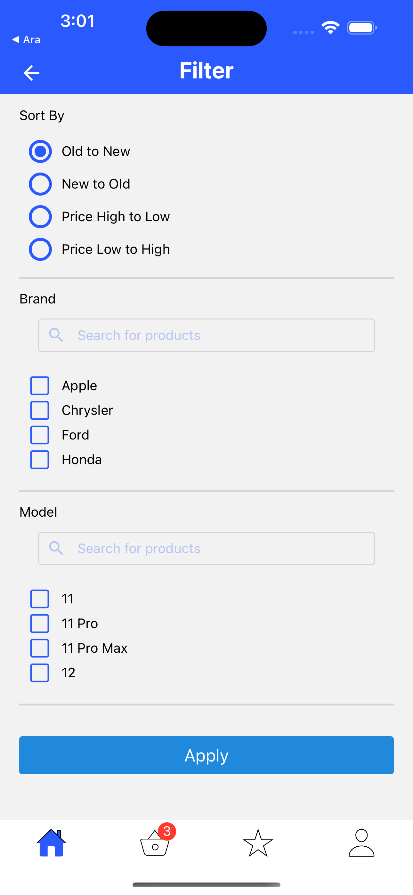
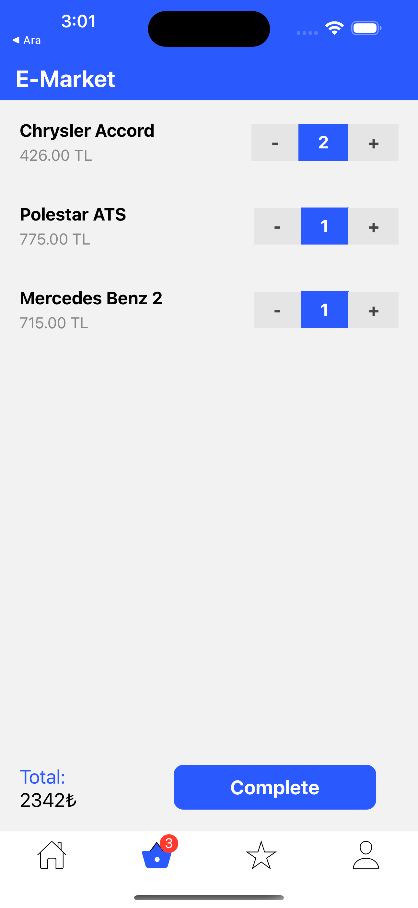
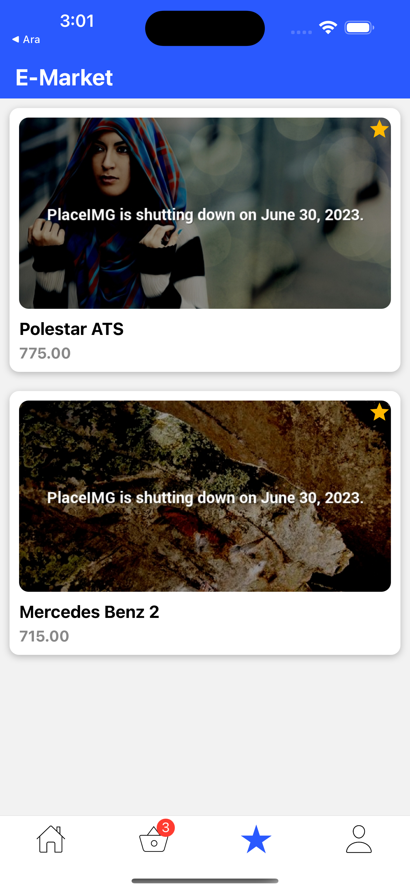

# Application Features
### - The application starts with a listing screen.
### - Products API is fetched from here: https://5fc9346b2af77700165ae514.mockapi.io/products.
### - Products are displayed on the screen with 12 items at a time, and an infinite scroll structure is implemented.
### - When a product is selected from the list, the user is directed to the screen that displays the details of that product.
### - By tapping the "add to cart" button on the screen, the product is added to the cart.
### - The number of products in the cart can be increased or decreased on the "Cart" screen, and the cart is updated accordingly. 
### - Products added to the cart are saved even if the application is closed and resumed from the same point later.
### - Filtering can be applied using the filters located on the right side of the screen.
### - The "Search" field on the homepage can be used to search for products by name among all the products, and the list below is updated accordingly.
### - By clicking on any of the products, users can navigate to the "Product Detail" screen and add the product to the cart from there as well.

 

# 
App Screen Shoots
 
 

</img>
</img>

</img>
</img>

 
</img>

